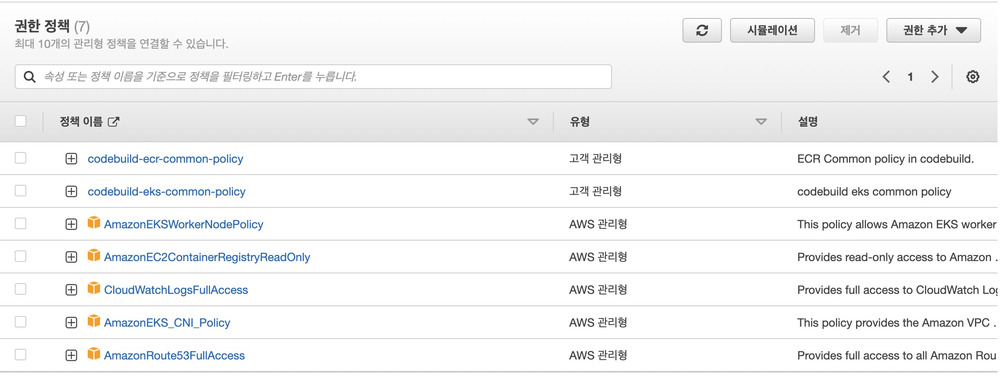

# EKS Cluster 구축

EKS Cluster를 생성하기 위해 EKS Cluster Role과 Worker Node Role을 생성해야 한다. 
- EKS Cluster 생성 (정책 연결)
- EKS Worker Node 생성 (정책 연결)


## EKS Cluster Role
- AmazonEKSClusterPolicy
- AmazonEKSServicePolicy  or **AmazonEKSVPCResourceController**
eks.amazonaws.com에 대한 AssumeRole을 위한 Role을 생성하고 위의 Policy를 attache 한다.
- role name : **systems-eks-cluster-role**
```json
{
  "Version": "2012-10-17",
  "Statement": [
    {
      "Effect": "Allow",
      "Principal": {
        "Service": "eks.amazonaws.com"
      },
      "Action": "sts:AssumeRole"
    }
  ]
}
```

## Worker Node Role
워커 노드에 Pod를 배포하기 위해서는 적절한 권한을 가져야 한다.
- WorkerNode Policy
- 컨테이너 이미지 접근을 위한 ECR 권한
- 로그 관리를 위한 CloudwatchLogsFullAccess
- VPC의 CIDR을 가지고 매핑 구성을 위한 CNI와 관련된 Policy
- ELB 구성 했을 때 자동적으로 DNS 매핑 구성을 위한 Route53 Policy
- HPA, AutoScaller와 같은 정책을 수행하기 위한 EKS-AutoScailer
- ALB 연동을 위한 ALBIngreddControllerAMPolicy

- Worker Node Role : **systems-eks-worker-node-role**
  - 관리형 Policy
    - AmazonEKSClusterPolicy
    - AmazonEKSWorkerNodePolicy
    - AamzonEC2ContainerRegistryReadOnly
    - CloudWatchAgentServerPolicy
    - CloudWatchLogsFullAccess
    - AmazonEKS_CNI_Policy
    - AmazonEKS_CNI_Policy
    - AmazonRoute53FullAccess
  - 사용자 Policy
    - systems-eks-worker-node-autoscailer-policy
```json
{
  "Version": "2012-10-17",
  "Statement": [
    {
      "Action": [
        "autoscaling:DescribeAutoScalingGroups",
        "autoscaling:DescribeAutoScalingInstances",
        "autoscaling:DescribeLaunchConfigurations",
        "autoscaling:DescribeTags",
        "autoscaling:SetDesiredCapacity",
        "autoscaling:TerminateInstanceInAutoScalingGroup",
        "ec2:DescribeLaunchTemplateVersions"
      ],
      "Resource": "*",
      "Effect": "Allow"
    }
  ]
}
```
  - systems-eks-worker-node-albingresscontroller-policy
```json
{
   "Version": "2012-10-17",
   "Statement": [
     {
        "Effect": "Allow",
        "Action": [
           "acm:DescribeCertificate",
           "acm:ListCertificates",
           "acm:GetCertificate"
        ],
        "Resource": "*"
     },
     {
        "Effect": "Allow",
        "Action": [
           "ec2:AuthorizeSecurityGroupIngress",
           "ec2:CreateSecurityGroup",
           "ec2:CreateTags",
           "ec2:DeleteTags",
           "ec2:DeleteSecurityGroup",
           "ec2:DescribeAccountAttributes",
           "ec2:DescribeAddresses",
           "ec2:DescribeInstances",
           "ec2:DescribeInstanceStatus",
           "ec2:DescribeInternetGateways",
           "ec2:DescribeNetworkInterfaces",
           "ec2:DescribeSecurityGroups",
           "ec2:DescribeSubnets",
           "ec2:DescribeTags",
           "ec2:DescribeVpcs",
           "ec2:ModifyInstanceAttribute",
           "ec2:ModifyNetworkInterfaceAttribute",
           "ec2:RevokeSecurityGroupIngress"
        ],
        "Resource": "*"
     },
     {
        "Effect": "Allow",
        "Action": [
           "elasticloadbalancing:AddListenerCertificates",
           "elasticloadbalancing:AddTags",
           "elasticloadbalancing:CreateListener",
           "elasticloadbalancing:CreateLoadBalancer",
           "elasticloadbalancing:CreateRule",
           "elasticloadbalancing:CreateTargetGroup",
           "elasticloadbalancing:DeleteListener",
           "elasticloadbalancing:DeleteLoadBalancer",
           "elasticloadbalancing:DeleteRule",
           "elasticloadbalancing:DeleteTargetGroup",
           "elasticloadbalancing:DeregisterTargets",
           "elasticloadbalancing:DescribeListenerCertificates",
           "elasticloadbalancing:DescribeListeners",
           "elasticloadbalancing:DescribeLoadBalancers",
           "elasticloadbalancing:DescribeLoadBalancerAttributes",
           "elasticloadbalancing:DescribeRules",
           "elasticloadbalancing:DescribeSSLPolicies",
           "elasticloadbalancing:DescribeTags",
           "elasticloadbalancing:DescribeTargetGroups",
           "elasticloadbalancing:DescribeTargetGroupAttributes",
           "elasticloadbalancing:DescribeTargetHealth",
           "elasticloadbalancing:ModifyListener",
           "elasticloadbalancing:ModifyLoadBalancerAttributes",
           "elasticloadbalancing:ModifyRule",
           "elasticloadbalancing:ModifyTargetGroup",
           "elasticloadbalancing:ModifyTargetGroupAttributes",
           "elasticloadbalancing:RegisterTargets",
           "elasticloadbalancing:RemoveListenerCertificates",
           "elasticloadbalancing:RemoveTags",
           "elasticloadbalancing:SetIpAddressType",
           "elasticloadbalancing:SetSecurityGroups",
           "elasticloadbalancing:SetSubnets",
           "elasticloadbalancing:SetWebACL"
        ],
        "Resource": "*"
    },
    {
        "Effect": "Allow",
        "Action": [
           "iam:CreateServiceLinkedRole",
           "iam:GetServerCertificate",
           "iam:ListServerCertificates"
        ],
        "Resource": "*"
    },
    {
        "Effect": "Allow",
        "Action": [
           "cognito-idp:DescribeUserPoolClient"
        ],
        "Resource": "*"
    },
    {
        "Effect": "Allow",
        "Action": [
           "waf-regional:GetWebACLForResource",
           "waf-regional:GetWebACL",
           "waf-regional:AssociateWebACL",
           "waf-regional:DisassociateWebACL"
        ],
        "Resource": "*"
    },
    {
        "Effect": "Allow",
        "Action": [
           "tag:GetResources",
           "tag:TagResources"
        ],
        "Resource": "*"
    },
    {
        "Effect": "Allow",
        "Action": [
           "waf:GetWebACL"
        ],
        "Resource": "*"
    }
  ]
}
```
- eks-cluster-worker-node-ses-policy
```json
{
    "Version": "2012-10-17",
    "Statement": [
        {
            "Sid": "VisualEditor0",
            "Effect": "Allow",
            "Action": "ses:SendEmail",
            "Resource": [
                "arn:aws:ses:*:807380035085:identity/*",
                "arn:aws:ses:*:807380035085:configuration-set/*"
            ]
        },
        {
            "Sid": "VisualEditor1",
            "Effect": "Allow",
            "Action": [
                "ses:CreateReceiptRule",
                "ses:SetIdentityMailFromDomain",
                "ses:DeleteReceiptFilter",
                "ses:VerifyEmailIdentity",
                "ses:CreateReceiptFilter",
                "ses:CreateConfigurationSetTrackingOptions",
                "ses:ListReceiptFilters",
                "ses:UpdateAccountSendingEnabled",
                "ses:DeleteConfigurationSetEventDestination",
                "ses:GetIdentityMailFromDomainAttributes",
                "ses:DeleteVerifiedEmailAddress",
                "ses:DeleteIdentityPolicy",
                "ses:ListContactLists",
                "ses:GetIdentityDkimAttributes",
                "ses:UpdateTemplate",
                "ses:DescribeReceiptRuleSet",
                "ses:ListReceiptRuleSets",
                "ses:PutAccountSendingAttributes",
                "ses:DeleteConfigurationSetTrackingOptions",
                "ses:GetTemplate",
                "ses:UpdateConfigurationSetTrackingOptions",
                "ses:SetIdentityNotificationTopic",
                "ses:SetIdentityDkimEnabled",
                "ses:ListDeliverabilityTestReports",
                "ses:GetSuppressedDestination",
                "ses:CreateConfigurationSet",
                "ses:DeleteReceiptRuleSet",
                "ses:PutIdentityPolicy",
                "ses:CreateTemplate",
                "ses:ReorderReceiptRuleSet",
                "ses:GetIdentityVerificationAttributes",
                "ses:DescribeReceiptRule",
                "ses:DeleteSuppressedDestination",
                "ses:GetAccount",
                "ses:GetBlacklistReports",
                "ses:CreateReceiptRuleSet",
                "ses:CreateConfigurationSetEventDestination",
                "ses:ListVerifiedEmailAddresses",
                "ses:SetIdentityFeedbackForwardingEnabled",
                "ses:PutAccountDedicatedIpWarmupAttributes",
                "ses:UpdateConfigurationSetEventDestination",
                "ses:ListTemplates",
                "ses:CreateImportJob",
                "ses:PutDeliverabilityDashboardOption",
                "ses:GetDeliverabilityDashboardOptions",
                "ses:ListCustomVerificationEmailTemplates",
                "ses:DeleteCustomVerificationEmailTemplate",
                "ses:TestRenderTemplate",
                "ses:GetIdentityPolicies",
                "ses:GetSendQuota",
                "ses:DescribeConfigurationSet",
                "ses:DeleteConfigurationSet",
                "ses:DeleteReceiptRule",
                "ses:PutAccountSuppressionAttributes",
                "ses:GetDomainDeliverabilityCampaign",
                "ses:VerifyDomainDkim",
                "ses:VerifyDomainIdentity",
                "ses:CloneReceiptRuleSet",
                "ses:ListDedicatedIpPools",
                "ses:ListEmailIdentities",
                "ses:SetIdentityHeadersInNotificationsEnabled",
                "ses:ListConfigurationSets",
                "ses:ListDomainDeliverabilityCampaigns",
                "ses:ListIdentities",
                "ses:PutConfigurationSetDeliveryOptions",
                "ses:VerifyEmailAddress",
                "ses:UpdateReceiptRule",
                "ses:UpdateConfigurationSetReputationMetricsEnabled",
                "ses:GetCustomVerificationEmailTemplate",
                "ses:GetSendStatistics",
                "ses:GetIdentityNotificationAttributes",
                "ses:UpdateConfigurationSetSendingEnabled",
                "ses:ListIdentityPolicies",
                "ses:SetActiveReceiptRuleSet",
                "ses:PutSuppressedDestination",
                "ses:CreateCustomVerificationEmailTemplate",
                "ses:DescribeActiveReceiptRuleSet",
                "ses:GetAccountSendingEnabled",
                "ses:UpdateCustomVerificationEmailTemplate",
                "ses:DeleteTemplate",
                "ses:SetReceiptRulePosition",
                "ses:ListImportJobs",
                "ses:ListEmailTemplates",
                "ses:PutDedicatedIpWarmupAttributes",
                "ses:ListSuppressedDestinations",
                "ses:PutAccountDetails",
                "ses:GetDedicatedIp",
                "ses:DeleteIdentity"
            ],
            "Resource": "*"
        },
        {
            "Sid": "VisualEditor2",
            "Effect": "Allow",
            "Action": "ses:*",
            "Resource": [
                "arn:aws:ses:*:807380035085:identity/*",
                "arn:aws:ses:*:807380035085:configuration-set/*"
            ]
        },
        {
            "Sid": "VisualEditor3",
            "Effect": "Allow",
            "Action": "ses:*",
            "Resource": [
                "arn:aws:ses:*:807380035085:identity/*",
                "arn:aws:ses:*:807380035085:configuration-set/*"
            ]
        },
        {
            "Sid": "VisualEditor4",
            "Effect": "Allow",
            "Action": "ses:SendRawEmail",
            "Resource": [
                "arn:aws:ses:*:807380035085:identity/*",
                "arn:aws:ses:*:807380035085:configuration-set/*"
            ]
        },
        {
            "Sid": "VisualEditor5",
            "Effect": "Allow",
            "Action": "ses:*",
            "Resource": [
                "arn:aws:ses:*:807380035085:identity/*",
                "arn:aws:ses:*:807380035085:configuration-set/*"
            ]
        }
    ]
}
```
- systems-eks-full-policy
```json
{
    "Version": "2012-10-17",
    "Statement": [
        {
            "Sid": "VisualEditor0",
            "Effect": "Allow",
            "Action": [
                "ses:*",
                "eks:ListClusters",
                "eks:DescribeAddonVersions",
                "sqs:*",
                "eks:RegisterCluster",
                "eks:CreateCluster"
            ],
            "Resource": "*"
        },
        {
            "Sid": "VisualEditor1",
            "Effect": "Allow",
            "Action": "eks:*",
            "Resource": [
                "arn:aws:eks:*:807380035085:cluster/*",
                "arn:aws:eks:*:807380035085:fargateprofile/*/*/*",
                "arn:aws:eks:*:807380035085:nodegroup/*/*/*",
                "arn:aws:eks:*:807380035085:identityproviderconfig/*/*/*/*",
                "arn:aws:eks:*:807380035085:addon/*/*/*"
            ]
        }
    ]
}
```
- codebuild-ecs-task-execute-policy
```json
{
    "Version": "2012-10-17",
    "Statement": [
        {
            "Sid": "VisualEditor0",
            "Effect": "Allow",
            "Action": [
                "kms:DescribeCustomKeyStores",
                "kms:ListKeys",
                "kms:DeleteCustomKeyStore",
                "kms:GenerateRandom",
                "kms:UpdateCustomKeyStore",
                "kms:ListAliases",
                "kms:DisconnectCustomKeyStore",
                "kms:CreateKey",
                "kms:ConnectCustomKeyStore",
                "kms:CreateCustomKeyStore"
            ],
            "Resource": "*"
        },
        {
            "Sid": "VisualEditor1",
            "Effect": "Allow",
            "Action": [
                "s3:PutObject",
                "s3:GetObject",
                "s3:DeleteObject"
            ],
            "Resource": "arn:aws:s3:::*/*"
        },
        {
            "Sid": "VisualEditor2",
            "Effect": "Allow",
            "Action": [
                "s3:ListBucket",
                "s3:GetBucketAcl"
            ],
            "Resource": "arn:aws:s3:::*"
        },
        {
            "Sid": "VisualEditor3",
            "Effect": "Allow",
            "Action": [
                "ssm:GetParameters",
                "ssm:GetParameter"
            ],
            "Resource": "arn:aws:ssm:*:807380035085:parameter/*"
        },
        {
            "Sid": "VisualEditor4",
            "Effect": "Allow",
            "Action": "kms:*",
            "Resource": [
                "arn:aws:kms:*:807380035085:alias/*",
                "arn:aws:kms:*:807380035085:key/*"
            ]
        },
        {
            "Sid": "VisualEditor5",
            "Effect": "Allow",
            "Action": "ssm:*",
            "Resource": [
                "arn:aws:s3:::*",
                "arn:aws:ssm:*:807380035085:document/*",
                "arn:aws:ecs:*:807380035085:task/*",
                "arn:aws:ssm:*:807380035085:servicesetting/*",
                "arn:aws:ssm:*:807380035085:resource-data-sync/*",
                "arn:aws:ec2:*:807380035085:instance/*",
                "arn:aws:ssm:*:807380035085:opsmetadata/*",
                "arn:aws:ssm:*:807380035085:automation-execution/*",
                "arn:aws:ssm:*:807380035085:association/*",
                "arn:aws:ssm:*:807380035085:automation-definition/*:*",
                "arn:aws:ssm:*:807380035085:patchbaseline/*",
                "arn:aws:ssm:*:807380035085:session/*",
                "arn:aws:ssm:*:807380035085:managed-instance/*",
                "arn:aws:ssm:*:807380035085:parameter/*",
                "arn:aws:ssm:*:807380035085:maintenancewindow/*",
                "arn:aws:ssm:*:807380035085:opsitem/*"
            ]
        }
    ]
}
```

## EKS Cluster 접속 환경 설정
 - EKS에 접속할 수 있는 권한이 있으면 접속 정보를 받아와야 한다.
```shell
jms@Jungui-MacBookPro resource % aws eks --region ap-northeast-2 update-kubeconfig --name systems-eks-cluster
Added new context arn:aws:eks:ap-northeast-2:807380035085:cluster/systems-eks-cluster to /Users/jms/.kube/config
jms@Jungui-MacBookPro resource % kubectl get svc
NAME         TYPE        CLUSTER-IP   EXTERNAL-IP   PORT(S)   AGE
kubernetes   ClusterIP   172.20.0.1   <none>        443/TCP   23m
```

## EKS Cluster 접속 권한 부여
```shell
jms@Jungui-MacBookPro /tmp % kubectl edit configmap aws-auth -n kube-system

# Please edit the object below. Lines beginning with a '#' will be ignored,
# and an empty file will abort the edit. If an error occurs while saving this file will be
# reopened with the relevant failures.
#
apiVersion: v1
data:
  mapRoles: |
    - rolearn: arn:aws:iam::807380035085:role/systems-eks-worker-node-role
      username: system:node:{{EC2PrivateDNSName}}
      groups:
       - system:bootstrappers
       - system:nodes
       - system:node-proxier
    - rolearn: arn:aws:iam::807380035085:role/systems-eks-uer-role
      username: deveuser
      groups:
       - system:bootstrappers
       - system:nodes
       - system:node-proxier
  mapUsers: |
    - userarn: arn:aws:iam::807380035085:user/minsoub@bithumbsystems.com
      username: admin
      groups:
      - system:masters
    - userarn: arn:aws:iam::807380035085:user/devadmin
      username: admin
      groups:
      - system:masters
kind: ConfigMap
metadata:
  creationTimestamp: "2022-05-23T11:37:28Z"
  name: aws-auth
  namespace: kube-system
  resourceVersion: "1428167"
  uid: 82f45c70-909d-413a-8f34-f5859f11a6ce
```

## EKS Namespace 생성
```shell
jms@Jungui-MacBookPro resource % kubectl create ns systems-dev-ns
namespace/systems-dev-ns created
jms@Jungui-MacBookPro resource % kubectl create ns systems-prod-ns
namespace/systems-prod-ns created
jms@Jungui-MacBookPro resource %
```

## AWS Load Balancer Controller 설치 구성 (For EKS)
### VPC Subnet 태깅
- 로드 밸런서 또는 수신 컨트롤러의 자동 서브넷 검색을 위해 Amazon EKS 클러스터의 Amazon VPC Subnet에 태그를 지정해야 한다. 
  - Public Subnet
    - Tag Key :  kubernetes.io/role/elb
    - Tag Value : 1
  - Private Subnet
    - Tag Key :  kubernetes.io/role/internal-elb
    - Tag Value : 1
### AWS Load Balancer Controller 설치
  - Amazon EKS 클러스터에 AWS Load balancer controller는 Kubernetes 클러스터용 Elastic Load Balancer를 관리하는 컨트롤러이다.
  - 이 컨트롤러는 직접 설치해야 한다. 
  - curl -o iam_policy.json https://raw.githubusercontent.com/kubernetes-sigs/aws-load-balancer-controller/v2.2.0/docs/install/iam_policy.json
```json
{
   "Version": "2012-10-17",
   "Statement": [
      {
         "Effect": "Allow",
         "Action": [
            "iam:CreateServiceLinkedRole",
            "ec2:DescribeAccountAttributes",
            "ec2:DescribeAddresses",
            "ec2:DescribeAvailabilityZones",
            "ec2:DescribeInternetGateways",
            "ec2:DescribeVpcs",
            "ec2:DescribeSubnets",
            "ec2:DescribeSecurityGroups",
            "ec2:DescribeInstances",
            "ec2:DescribeNetworkInterfaces",
            "ec2:DescribeTags",
            "ec2:GetCoipPoolUsage",
            "ec2:DescribeCoipPools",
            "elasticloadbalancing:DescribeLoadBalancers",
            "elasticloadbalancing:DescribeLoadBalancerAttributes",
            "elasticloadbalancing:DescribeListeners",
            "elasticloadbalancing:DescribeListenerCertificates",
            "elasticloadbalancing:DescribeSSLPolicies",
            "elasticloadbalancing:DescribeRules",
            "elasticloadbalancing:DescribeTargetGroups",
            "elasticloadbalancing:DescribeTargetGroupAttributes",
            "elasticloadbalancing:DescribeTargetHealth",
            "elasticloadbalancing:DescribeTags"
         ],
         "Resource": "*"
      },
      {
         "Effect": "Allow",
         "Action": [
            "cognito-idp:DescribeUserPoolClient",
            "acm:ListCertificates",
            "acm:DescribeCertificate",
            "iam:ListServerCertificates",
            "iam:GetServerCertificate",
            "waf-regional:GetWebACL",
            "waf-regional:GetWebACLForResource",
            "waf-regional:AssociateWebACL",
            "waf-regional:DisassociateWebACL",
            "wafv2:GetWebACL",
            "wafv2:GetWebACLForResource",
            "wafv2:AssociateWebACL",
            "wafv2:DisassociateWebACL",
            "shield:GetSubscriptionState",
            "shield:DescribeProtection",
            "shield:CreateProtection",
            "shield:DeleteProtection"
         ],
         "Resource": "*"
      },
      {
         "Effect": "Allow",
         "Action": [
            "ec2:AuthorizeSecurityGroupIngress",
            "ec2:RevokeSecurityGroupIngress"
         ],
         "Resource": "*"
      },
      {
         "Effect": "Allow",
         "Action": [
            "ec2:CreateSecurityGroup"
         ],
         "Resource": "*"
      },
      {
         "Effect": "Allow",
         "Action": [
            "ec2:CreateTags"
         ],
         "Resource": "arn:aws:ec2:*:*:security-group/*",
         "Condition": {
             "StringEquals": {
                 "ec2:CreateAction": "CreateSecurityGroup"
             },
             "Null": {
                 "aws:RequestTag/elbv2.k8s.aws/cluster": "false"
             }
         }
      },
      {
         "Effect": "Allow",
         "Action": [
            "ec2:CreateTags",
            "ec2:DeleteTags"
         ],
         "Resource": "arn:aws:ec2:*:*:security-group/*",
         "Condition": {
             "Null": {
                "aws:RequestTag/elbv2.k8s.aws/cluster": "true",
                "aws:ResourceTag/elbv2.k8s.aws/cluster": "false"
             }
         }
      },
      {
         "Effect": "Allow",
         "Action": [
            "ec2:AuthorizeSecurityGroupIngress",
            "ec2:RevokeSecurityGroupIngress",
            "ec2:DeleteSecurityGroup"
         ],
         "Resource": "*",
         "Condition": {
            "Null": {
               "aws:ResourceTag/elbv2.k8s.aws/cluster": "false"
            }
         }
      },
      {
         "Effect": "Allow",
         "Action": [
            "elasticloadbalancing:CreateLoadBalancer",
            "elasticloadbalancing:CreateTargetGroup"
         ],
         "Resource": "*",
         "Condition": {
            "Null": {
            "aws:RequestTag/elbv2.k8s.aws/cluster": "false"
         }
      }
   },
   {
      "Effect": "Allow",
      "Action": [
         "elasticloadbalancing:CreateListener",
         "elasticloadbalancing:DeleteListener",
         "elasticloadbalancing:CreateRule",
         "elasticloadbalancing:DeleteRule"
      ],
      "Resource": "*"
   },
   {
      "Effect": "Allow",
      "Action": [
         "elasticloadbalancing:AddTags",
         "elasticloadbalancing:RemoveTags"
      ],
      "Resource": [
         "arn:aws:elasticloadbalancing:*:*:targetgroup/*/*",
         "arn:aws:elasticloadbalancing:*:*:loadbalancer/net/*/*",
         "arn:aws:elasticloadbalancing:*:*:loadbalancer/app/*/*"
      ],
      "Condition": {
         "Null": {
            "aws:RequestTag/elbv2.k8s.aws/cluster": "true",
            "aws:ResourceTag/elbv2.k8s.aws/cluster": "false"
         }
      }
   },
   {
      "Effect": "Allow",
      "Action": [
         "elasticloadbalancing:AddTags",
         "elasticloadbalancing:RemoveTags"
      ],
      "Resource": [
         "arn:aws:elasticloadbalancing:*:*:listener/net/*/*/*",
         "arn:aws:elasticloadbalancing:*:*:listener/app/*/*/*",
         "arn:aws:elasticloadbalancing:*:*:listener-rule/net/*/*/*",
         "arn:aws:elasticloadbalancing:*:*:listener-rule/app/*/*/*"
      ]
   },
   {
      "Effect": "Allow",
      "Action": [
         "elasticloadbalancing:ModifyLoadBalancerAttributes",
         "elasticloadbalancing:SetIpAddressType",
         "elasticloadbalancing:SetSecurityGroups",
         "elasticloadbalancing:SetSubnets",
         "elasticloadbalancing:DeleteLoadBalancer",
         "elasticloadbalancing:ModifyTargetGroup",
         "elasticloadbalancing:ModifyTargetGroupAttributes",
         "elasticloadbalancing:DeleteTargetGroup"
      ],
      "Resource": "*",
      "Condition": {
         "Null": {
            "aws:ResourceTag/elbv2.k8s.aws/cluster": "false"
         }
      }
   },
   {
      "Effect": "Allow",
      "Action": [
         "elasticloadbalancing:RegisterTargets",
         "elasticloadbalancing:DeregisterTargets"
      ],
      "Resource": "arn:aws:elasticloadbalancing:*:*:targetgroup/*/*"
   },
   {
      "Effect": "Allow",
      "Action": [
         "elasticloadbalancing:SetWebAcl",
         "elasticloadbalancing:ModifyListener",
         "elasticloadbalancing:AddListenerCertificates",
         "elasticloadbalancing:RemoveListenerCertificates",
         "elasticloadbalancing:ModifyRule"
      ],
      "Resource": "*"
   }
 ]
}
```
- 다운로드 받은 파일을 실행시켜 정책을 생성한다.
  - 정책명 : systems-ekc-cluster-awsloadbalancer-controller-policy
```shell
jms@Jungui-MacBookPro policy % aws iam create-policy --policy-name systems-eks-cluster-awsloadbalancer-controller-policy --policy-document file://iam_policy.json
{
    "Policy": {
        "PolicyName": "systems-eks-cluster-awsloadbalancer-controller-policy",
        "PolicyId": "ANPA3X64ZUYGWOWDLQUKD",
        "Arn": "arn:aws:iam::807380035085:policy/systems-eks-cluster-awsloadbalancer-controller-policy",
        "Path": "/",
        "DefaultVersionId": "v1",
        "AttachmentCount": 0,
        "PermissionsBoundaryUsageCount": 0,
        "IsAttachable": true,
        "CreateDate": "2022-05-23T16:24:38+00:00",
        "UpdateDate": "2022-05-23T16:24:38+00:00"
    }
}
```
- 위에서 생성된 Arn을 사용해서 Kubernetes 서비스 계정을 생성한다.
  - aws-load-balancer-controller의 systems-dev-ns 네임스페이스에 AWS Load Balancer 컨트롤러 이름 설정
  - role name : systems-eks-cluster-awsloadbalancer-controller-policy
```shell
jms@Jungui-MacBookPro policy % curl --silent --location "https://github.com/weaveworks/eksctl/releases/latest/download/eksctl_$(uname -s)_amd64.tar.gz" | tar xz -C /tmp
jms@Jungui-MacBookPro policy % sudo mv -v /tmp/eksctl /usr/local/bin
jms@Jungui-MacBookPro policy % eksctl version
0.98.0

jms@Jungui-MacBookPro policy % eksctl create iamserviceaccount \
  --cluster=systems-eks-cluster \
  --namespace=systems-dev-ns \
  --name=aws-load-balancer-dev-controller \
  --attach-policy-arn=arn:aws:iam::807380035085:policy/systems-eks-cluster-awsloadbalancer-controller-policy \
  --override-existing-serviceaccounts \
  --approve
```
- aws-load-balancer controller 설치
  - TargetGroupBinding 사용자 정의 리스트
```shell
jms@Jungui-MacBookPro policy % kubectl apply -k "github.com/aws/eks-charts/stable/aws-load-balancer-controller//crds?ref=master"
customresourcedefinition.apiextensions.k8s.io/ingressclassparams.elbv2.k8s.aws created
customresourcedefinition.apiextensions.k8s.io/targetgroupbindings.elbv2.k8s.aws created
```
- eks-charts 리포지토리 설정
  - helm 설치
```shell
jms@Jungui-MacBookPro policy % curl https://raw.githubusercontent.com/helm/helm/master/scripts/get-helm-3 > get_helm.sh
  % Total    % Received % Xferd  Average Speed   Time    Time     Time  Current
                                 Dload  Upload   Total   Spent    Left  Speed
100 11156  100 11156    0     0  32467      0 --:--:-- --:--:-- --:--:-- 33005

jms@Jungui-MacBookPro policy % chmod 700 get_helm.sh 
jms@Jungui-MacBookPro policy % ./get_helm.sh 
Downloading https://get.helm.sh/helm-v3.9.0-darwin-arm64.tar.gz
Verifying checksum... Done.
Preparing to install helm into /usr/local/bin
Password:
helm installed into /usr/local/bin/helm
```
- 리포지토리 설정
```shell
jms@Jungui-MacBookPro policy % curl https://raw.githubusercontent.com/helm/helm/master/scripts/get-helm-3 > get_helm.sh
  % Total    % Received % Xferd  Average Speed   Time    Time     Time  Current
                                 Dload  Upload   Total   Spent    Left  Speed
100 11156  100 11156    0     0  32467      0 --:--:-- --:--:-- --:--:-- 33005

jms@Jungui-MacBookPro policy % chmod 700 get_helm.sh 
jms@Jungui-MacBookPro policy % ./get_helm.sh 
Downloading https://get.helm.sh/helm-v3.9.0-darwin-arm64.tar.gz
Verifying checksum... Done.
Preparing to install helm into /usr/local/bin
Password:
helm installed into /usr/local/bin/helm
```
- aws load balancer 설치
```shell
helm upgrade -i aws-load-balancer-controller eks/aws-load-balancer-controller \
  --set clusterName=systems-eks-cluster \
  --set serviceAccount.create=false \
  --set region=ap-northeast-2 \
  --set vpcId=vpc-0c46c80eb059ca036 \
  --set serviceAccount.name=aws-load-balancer-dev-controller \
  -n systems-dev-ns
```

- Troubleshooting
  - aws cli 버그로 인해 이전 버전에서 api 버전 에러가 발생할 수 있다. 그럴 경우 아래의 버전이 맞는지 확인한다.
```shell
awscli version : 2.7.1 이상
kubectl : 1.24.0 (optional) - 낮으 버전을 사용함
helm : 3.9.1

jms@Jungui-MacBookPro /tmp % aws eks --region ap-northeast-2 update-kubeconfig --name systems-eks-cluster
위의 명령어를 수행 후 aws load blanacer를 설치한다.
```

# CodeBuild에서 EKS를 사용할 수 있는 권한 부여
- codebuild-eks-common-policy.json
```json
```jsx
{
    "Version": "2012-10-17",
    "Statement": [
        {
            "Sid": "VisualEditor0",
            "Effect": "Allow",
            "Action": [
                "eks:DescribeNodegroup",
                "eks:DescribeUpdate",
                "eks:DescribeCluster"
            ],
            "Resource": [
                "arn:aws:eks:*:807380035085:cluster/*",
                "arn:aws:eks:*:807380035085:nodegroup/*/*/*",
                "arn:aws:eks:*:807380035085:addon/*/*/*"
            ]
        }
    ]
}
```
- 역할 생성 및 정책 연결 : codebuild-eks-service-role
    - 아래 권한 정책을 추가한다.
  
    - 신뢰할 수 있는 엔티티에 codebuild에 대한 Principal을 추가한다. (codebuild 생성시마다 추가하거나 수정해야 한다)
```json
{
    "Version": "2012-10-17",
    "Statement": [
        {
            "Effect": "Allow",
            "Principal": {
                "AWS": [
                    "arn:aws:iam::807380035085:role/service-role/codebuild-systems-auth-api-eks-dev-codebuild-service-role",
                    "arn:aws:iam::807380035085:role/service-role/codebuild-systems-gateway-api-eks-dev-build-service-role"
                ]
            },
            "Action": "sts:AssumeRole"
        }
    ]
}
```
- 생성된 Role에 대해서 EKS의 configmap에 등록한다.
```shell
jms@Jungui-MacBookPro /tmp % kubectl edit configmap aws-auth -n kube-system

# Please edit the object below. Lines beginning with a '#' will be ignored,
# and an empty file will abort the edit. If an error occurs while saving this file will be
# reopened with the relevant failures.
#
apiVersion: v1
data:
  mapRoles: |
    - rolearn: arn:aws:iam::807380035085:role/systems-eks-worker-node-role
      username: system:node:{{EC2PrivateDNSName}}
      groups:
       - system:bootstrappers
       - system:nodes
       - system:node-proxier
    - rolearn: arn:aws:iam::807380035085:role/systems-eks-uer-role
      username: deveuser
      groups:
       - system:bootstrappers
       - system:nodes
       - system:node-proxier
    - rolearn: arn:aws:iam::807380035085:role/codebuild-eks-service-role
      username: build
      groups:
       - system: master
  mapUsers: |
    - userarn: arn:aws:iam::807380035085:user/minsoub@bithumbsystems.com
      username: admin
      groups:
      - system:masters
    - userarn: arn:aws:iam::807380035085:user/devadmin
      username: admin
      groups:
      - system:masters
kind: ConfigMap
metadata:
  creationTimestamp: "2022-05-23T11:37:28Z"
  name: aws-auth
  namespace: kube-system
  resourceVersion: "1428167"
  uid: 82f45c70-909d-413a-8f34-f5859f11a6ce
```
- 빌드 수행 파일인 buildspec.yml 파일에서 해당 Role을 가지고 EKS를 수행할 수 있도록 한다. 
  - SERVICE_ROLE에 대해서 확인하고 코드빌드에 대한 서비스롤을 등록한다. 
```yaml
version: 0.2

env:
  variables:
    SPRING_PROFILE: "dev"
    REPO_URI: "807380035085.dkr.ecr.ap-northeast-2.amazonaws.com/systems-auth-api-dev-repo"
    CONTAINER_NAME: "systems-auth-api-dev-container"
    JAR_FILE_NAME: "./auth-api/build/libs/auth-api-0.0.1-SNAPSHOT.jar"
    SERVICE_ROLE: "arn:aws:iam::807380035085:role/service-role/codebuild-systems-auth-api--service-role"
    KUBECTL_URL: "https://amazon-eks.s3.us-west-2.amazonaws.com/1.19.6/2021-01-05/bin/linux/amd64/kubectl"
    EKS_ROLE: "arn:aws:iam::807380035085:role/codebuild-eks-service-role"
    DEPLOYMENT_FILE: "./deploy/systems-auth-api-deployment.yml"
    SERVICE_FILE: "./deploy/systems-auth-api-service.yml"
    NAMESPACE: "systems-dev-ns"
phases:
  install:
    runtime-versions:
      docker: 18
    commands:
      - echo Logging in to Amazon EKS...
      - curl -o kubectl $ KUBECTL_URL
      - chmod +x ./kubectl
      - mv ./kubectl /usr/local/bin/kubectl
      - mkdir ~/.kube
      - aws eks --region ap-northeast-2 update-kubeconfig --name systems-eks-cluster --role-arn $EKS_ROLE
      - aws sts get-caller-identity
      - kubectl get svc -n $NAMESPACE
      - kubectl get po -n $NAMESPACE
  pre_build:
    commands:
      - echo Logging in to Amazon ECR...
      - aws --version
      - aws ecr get-login-password --region ap-northeast-2 | docker login --username AWS --password-stdin ${REPO_URI}
      - REPOSITORY_URI=${REPO_URI}
      - COMMIT_HASH=$(echo $CODEBUILD_RESOLVED_SOURCE_VERSION | cut -c 1-7)
      - IMAGE_TAG=${COMMIT_HASH:=latest}
      - ASSUME_ROLE_ARN=${SERVICE_ROLE}
      - TEMP_ROLE=$(aws sts assume-role --role-arn ${ASSUME_ROLE_ARN} --role-session-name test)
      - export TEMP_ROLE
      - export AWS_ACCESS_KEY_ID=$(echo "${TEMP_ROLE}" | jq -r '.Credentials.AccessKeyId')
      - export AWS_SECRET_ACCESS_KEY=$(echo "${TEMP_ROLE}" | jq -r '.Credentials.SecretAccessKey')
      - export AWS_SESSION_TOKEN=$(echo "${TEMP_ROLE}" | jq -r '.Credentials.SessionToken')
  build:
    commands:
      - chmod +x ./gradlew
      - echo Unit testing ...
      - #SPRING_PROFILES_ACTIVE=${SPRING_PROFILE} ./gradlew test
      - echo build make jar
      - ./gradlew assemble
      - echo Build started on `date`
      - echo Building the Docker image ...
      - docker build -f docker/Dockerfile -t $REPOSITORY_URI:latest --build-arg JAR_FILE=$JAR_FILE_NAME --build-arg PROFILES=${SPRING_PROFILE} --build-arg AWS_ACCESS_KEY_ID=$AWS_ACCESS_KEY_ID --build-arg AWS_SECRET_ACCESS_KEY=$AWS_SECRET_ACCESS_KEY --build-arg AWS_SESSION_TOKEN=$AWS_SESSION_TOKEN .
      - echo Build completed on `date`
  post_build:
    commands:
      - echo $REPOSITORY_URI:$IMAGE_TAG
      - docker tag $REPOSITORY_URI:latest $REPOSITORY_URI:$IMAGE_TAG
      - echo docker tag completed on `date`
      - echo Pushing the Docker images ...
      - ls -al
      - docker push $REPOSITORY_URI:latest
      - docker push $REPOSITORY_URI:$IMAGE_TAG
      - echo Writing image definitions file...
      - printf '[{"name":"%s", "imageUri":"%s"}]' $CONTAINER_NAME $REPOSITORY_URI:latest > imageDefinitions.json
      - ls -al
      - AWS_ECR_URI=$REPOSITORY_URI:$IMAGE_TAG
      - sed -i.bak 's#AWS_ECR_URI#'"$AWS_ECR_URI"'#' $DEPLOYMENT_FILE
      - sed -i.bak 's#NAMESPACE#'"$NAMESPACE"'#' $DEPLOYMENT_FILE
      - sed -i.bak 's#NAMESPACE#'"$NAMESPACE"'#' $SERVICE_FILE
      - cat $DEPLOYMENT_FILE
      - kubectl apply -f $DEPLOYMENT_FILE
      - kubectl apply -f $SERVICE_FILE
cache:
  paths:
    - '/root/.gradle/**/*'
artifacts:
  files: imageDefinitions.json
```
- codebuild 서비스 Role에 위의 Role이 추가될 수 있도록 한다. 

# EKS Pod 서비스에 대한 외부 접속 Port 설정
- Security Group : systems-eks-cluster-sg
```text
9070,  7070,  80,  8080,  27017,  443,  3000,  6379
```
- Document DB, Redis DB에 접근하기 위한 서브넷을 생성한다.
  - pod는 Private Subnet에 설치되므로 Private Subnet에서 데이터베이스 접속할 수 있도록 각 데이터베이스에 서브넷을 등록한다. 

# EKS 배포를 위한 CodeBuild 프로젝트 생성
- EKS에 pod 배포를 위해서 codebuild를 사용한다. codecommit에서 커밋 되었을 때 Codebuild가 실행되고 Codebuild에서 빌드하고 pod에 배포한다.
- 코드 빌드 생성 완료 후 생성된 서비스 Role에 위에서 생성한 서비스 Role에 대한 권한을 부여한다.
- 추가할 권한
  - codebuild-ecr-common-policy
  - codebuild-eks-common-policy
  - AmazonEKSWorkerNodePolicy (AWS 관리형 정책 )
  - AmazonEC2ContainerRegistryReadOnly (AWS 관리형 정책 )
  - CloudWatchLogsFullAccess (AWS 관리형 정책 )
  - AmazonEKS_CNI_Policy (AWS 관리형 정책 )
  - AmazonRoute53FullAccess (AWS 관리형 정책 )

# POD 실행 여부 확인
```shell
jms@Jungui-MacBookPro /tmp % kubectl get pod -n systems-dev-ns                               
NAME                                            READY   STATUS    RESTARTS   AGE
aws-load-balancer-controller-6f947df5b4-2fzbr   1/1     Running   0          47h
aws-load-balancer-controller-6f947df5b4-h6bwn   1/1     Running   0          47h
systems-auth-api-6f78f8dd94-bhsv4               1/1     Running   0          3m20s
systems-auth-api-6f78f8dd94-d7w62               1/1     Running   0          3m18s
```
## Log 확인
```shell
jms@Jungui-MacBookPro /tmp % kubectl logs systems-auth-api-6f78f8dd94-bhsv4 -n systems-dev-ns
```

# Troubleshooting
- Service external-ip pending 상태
  - 로그를 확인한다.
```shell
jms@Jungui-MacBookPro ~ % kubectl describe service systems-auth-api-nlb -n systems-dev-ns
Name:                     systems-auth-api-nlb
Namespace:                systems-dev-ns
Labels:                   <none>
Annotations:              service.beta.kubernetes.io/aws-load-balancer-type: nlb-ip
Selector:                 app=systems-auth-api
Type:                     LoadBalancer
IP Family Policy:         SingleStack
IP Families:              IPv4
IP:                       172.20.216.232
IPs:                      172.20.216.232
Port:                     <unset>  80/TCP
TargetPort:               8080/TCP
NodePort:                 <unset>  31927/TCP
Endpoints:                10.2.10.107:8080,10.2.11.109:8080
Session Affinity:         None
External Traffic Policy:  Cluster
```

# EKS Service 와 Deployment 배포
- Sample Application : systems-gateway-api
  - [ Service ]
```yaml
apiVersion: v1
kind: Service
metadata:
  namespace: NAMESPACE
  name: systems-gateway-api-nlb
  annotations:
    service.beta.kubernetes.io/aws-load-balancer-type: nlb-ip
spec:
  ports:
    - port: 80
      targetPort: 7070
      protocol: TCP
  type: LoadBalancer
  selector:
    app: systems-gateway-api
```
  - [ Deployment ]
```yaml
apiVersion: v1
kind: Service
metadata:
  namespace: NAMESPACE
  name: systems-gateway-api-nlb
  annotations:
    service.beta.kubernetes.io/aws-load-balancer-type: nlb-ip
spec:
  ports:
    - port: 80
      targetPort: 7070
      protocol: TCP
  type: LoadBalancer
  selector:
    app: systems-gateway-api
```
# 외부 연결을 위한 Ingress ALB 생성 
- systems-gateway-api-ingress.yml
```yaml
apiVersion: networking.k8s.io/v1
kind: Ingress
metadata:
  namespace: systems-dev-ns
  name: systems-gateway-api-ingress
  annotations:
    kubernetes.io/ingress.class: alb
    alb.ingress.kubernetes.io/scheme: internet-facing
    alb.ingress.kubernetes.io/target-type: instance
    alb.ingress.kubernetes.io/security-groups: sg-0cbc30ceb65f60a41
    alb.ingress.kubernetes.io/listen-ports: '[{"HTTP": 80}, {"HTTPS": 443}]'
    alb.ingress.kubernetes.io/certificate-arn: arn:aws:acm:ap-northeast-2:807380035085:certificate/1508751a-aff5-4f0c-80b2-0d9bee1ab212
    alb.ingress.kubernetes.io/ssl-policy: ELBSecurityPolicy-2016-08
spec:
  rules:
    - http:
        paths:
          - path: /
            pathType: Prefix
            backend:
              service:
                name: systems-gateway-api-nlb
                port:
                  number: 80
```

- 내부 연결 DNS 생성 확인
```shell
jms@Jungui-MacBookPro ~ % kubectl get svc -n systems-dev-ns
NAME                                TYPE           CLUSTER-IP       EXTERNAL-IP                                                                          PORT(S)        AGE
aws-load-balancer-webhook-service   ClusterIP      172.20.99.161    <none>                                                                               443/TCP        21d
cpc-app-api-nlb                     LoadBalancer   172.20.164.134   k8s-systemsd-cpcappap-0fd4253b97-c2bdae0b9ed776ca.elb.ap-northeast-2.amazonaws.com   80:31956/TCP   16d
cpc-app-web-nlb                     LoadBalancer   172.20.157.131   k8s-systemsd-cpcappwe-a12f163f8d-1d1c1a9178729528.elb.ap-northeast-2.amazonaws.com   80:30534/TCP   16d
lrc-app-api-nlb                     LoadBalancer   172.20.6.178     k8s-systemsd-lrcappap-51a49fed08-97638021b6a67650.elb.ap-northeast-2.amazonaws.com   80:30118/TCP   16d
lrc-app-web-nlb                     LoadBalancer   172.20.73.54     k8s-systemsd-lrcappwe-18cb8e5b86-0a462e4b775ad5ee.elb.ap-northeast-2.amazonaws.com   80:31473/TCP   14d
systems-auth-api-nlb                LoadBalancer   172.20.9.248     k8s-systemsd-systemsa-b1008c664c-a3ca74a448432ee0.elb.ap-northeast-2.amazonaws.com   80:32101/TCP   18d
systems-chat-api-nlb                LoadBalancer   172.20.79.236    k8s-systemsd-systemsc-a28a8d39d2-a8abc72cd79eb1cd.elb.ap-northeast-2.amazonaws.com   80:31695/TCP   16d
systems-gateway-api-nlb             LoadBalancer   172.20.216.127   k8s-systemsd-systemsg-d8965d6033-f02444dccaaaabac.elb.ap-northeast-2.amazonaws.com   80:31450/TCP   18d
systems-mng-api-nlb                 LoadBalancer   172.20.249.170   k8s-systemsd-systemsm-3411cecba4-a185780c02b3ce0f.elb.ap-northeast-2.amazonaws.com   80:30851/TCP   16d
systems-mng-web-nlb                 LoadBalancer   172.20.201.139   k8s-systemsd-systemsm-0c8bb29483-687dd749790b1485.elb.ap-northeast-2.amazonaws.com   80:30347/TCP   16d
```
- 외부 연결 확인
```shell
jms@Jungui-MacBookPro ~ % kubectl get ingress -n systems-dev-ns
NAME                          CLASS    HOSTS   ADDRESS                                                                        PORTS   AGE
cpc-app-web-ingress           <none>   *       k8s-systemsd-cpcappwe-c3110031ec-598124796.ap-northeast-2.elb.amazonaws.com    80      16d
lrc-app-web-ingress           <none>   *       k8s-systemsd-lrcappwe-3ba5072e02-1786558476.ap-northeast-2.elb.amazonaws.com   80      16d
systems-gateway-api-ingress   <none>   *       k8s-systemsd-systemsg-ebcd4f0604-1552855188.ap-northeast-2.elb.amazonaws.com   80      18d
systems-mng-web-ingress       <none>   *       k8s-systemsd-systemsm-5b1ad0cbb7-1915523199.ap-northeast-2.elb.amazonaws.com   80      16d
jms@Jungui-MacBookPro ~ %
```
- 어플리케이션 로그 확인을 위한 컨테이너 접속
  - pod 명칭 확인
```shell
jms@Jungui-MacBookPro ~ % kubectl get pod -n systems-dev-ns                                             
NAME                                            READY   STATUS             RESTARTS          AGE
aws-load-balancer-controller-6f947df5b4-2fzbr   1/1     Running            0                 21d
aws-load-balancer-controller-6f947df5b4-h6bwn   1/1     Running            0                 21d
cpc-app-api-584664b957-lkklk                    1/1     Running            0                 15h
cpc-app-api-584664b957-vjfng                    1/1     Running            0                 15h
cpc-app-web-5897bfcc8b-hnb29                    1/1     Running            0                 16h
cpc-app-web-5897bfcc8b-vwhmp                    1/1     Running            0                 16h
lrc-app-api-85c666b976-f2ssz                    1/1     Running            0                 2d15h
lrc-app-api-85c666b976-w9n8s                    1/1     Running            0                 2d15h
lrc-app-web-6dc9bc8455-bfhqx                    1/1     Running            0                 2d15h
lrc-app-web-6dc9bc8455-vtfk7                    1/1     Running            0                 2d15h
systems-auth-api-6649d4bbf5-gckjf               1/1     Running            0                 27h
systems-auth-api-6649d4bbf5-qddq7               1/1     Running            0                 27h
systems-chat-api-c6f444f67-8nhwf                0/1     CrashLoopBackOff   329 (2m19s ago)   27h
systems-chat-api-c6f444f67-lfp6d                0/1     CrashLoopBackOff   329 (3m18s ago)   27h
systems-gateway-api-56d7fcc84c-ht7mz            1/1     Running            0                 2d16h
systems-gateway-api-56d7fcc84c-wj2t4            1/1     Running            0                 2d16h
systems-mng-api-795c979f7-8kdbh                 1/1     Running            0                 14h
systems-mng-api-795c979f7-fk5l8                 1/1     Running            0                 14h
systems-mng-web-5f88c88544-x4bvz                1/1     Running            0                 14h
systems-mng-web-5f88c88544-xxc5z                1/1     Running            0                 14h


jms@Jungui-MacBookPro ~ % kubectl logs systems-chat-api-c6f444f67-8nhwf  -n systems-dev-ns
```
  - exec 사용해서 컨테이너 내부 확인
```shell
jms@Jungui-MacBookPro ~ % kubectl exec -it cpc-app-api-584664b957-vjfng -n systems-dev-ns /bin/bash
kubectl exec [POD] [COMMAND] is DEPRECATED and will be removed in a future version. Use kubectl exec [POD] -- [COMMAND] instead.
[root@cpc-app-api-584664b957-vjfng app]# ls -al
total 62432
drwxr-xr-x 1 root root       18 Jun 20 17:11 .
drwxr-xr-x 1 root root       28 Jun 20 17:11 ..
-rw-r--r-- 1 root root 63923367 Jun 20 17:10 cpc-app-api.jar
-rwxr-xr-x 1 root root      303 Jun 20 17:06 entrypoint.sh
drwxr-xr-x 1 root root       70 Jun 21 00:00 logs
[root@cpc-app-api-584664b957-vjfng app]# cd logs
[root@cpc-app-api-584664b957-vjfng logs]# ls
error  spring.log  spring.log.20220620.0.log
[root@cpc-app-api-584664b957-vjfng logs]# tail -f spring.log
```