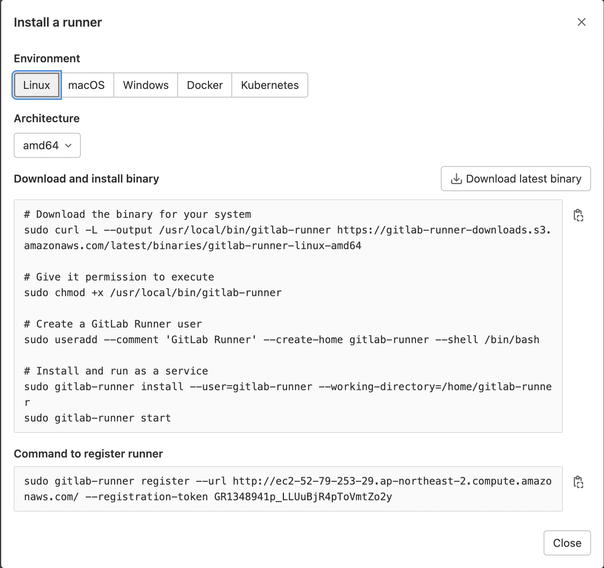
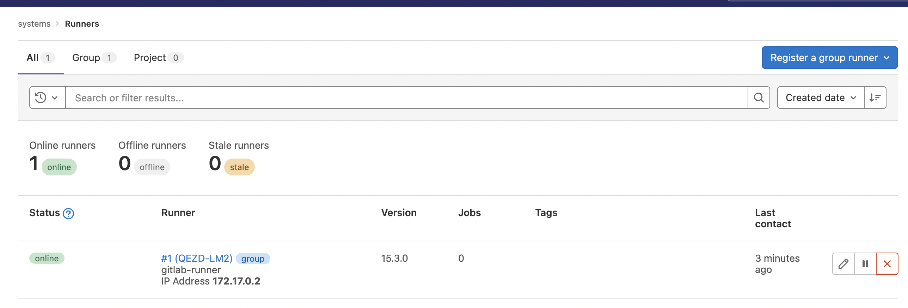
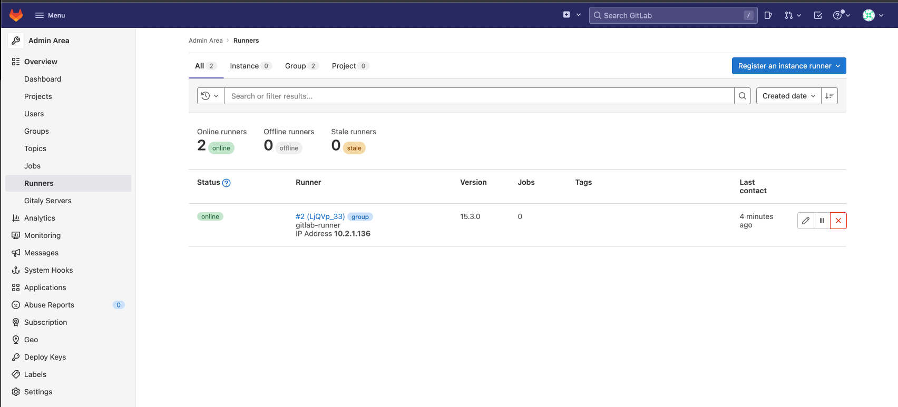
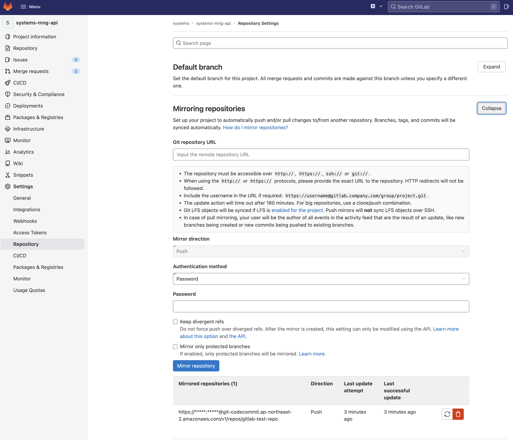

# Gitlab Server 구축

## EC2 서버 구축
- 외부 접속을 위한 Public Subnet을 가진 인스턴스 생성
- 보안을 위해서 시스템즈의 아이피만 허용하도록 보안 그룹 생성 및 연결

## [ Gitlab Server 설치 ]
- Gitlab Version : 15.2
- 필요한 의존성 설치 및 구성
```shell
[ec2-user@ip-10-2-1-163 gitlab]$ sudo yum install -y curl policycoreutils-python openssh-server openssh-clients perl
[ec2-user@ip-10-2-1-163 gitlab]$ sudo systemctl enable sshd
[ec2-user@ip-10-2-1-163 gitlab]$ sudo systemctl start sshd
```
- Notification email 전송을 위한 Postfix 설치
```shell
[ec2-user@ip-10-2-1-163 gitlab]$ sudo yum install postfix
[ec2-user@ip-10-2-1-163 gitlab]$ sudo systemctl enable postfix
[ec2-user@ip-10-2-1-163 gitlab]$ sudo systemctl start postfix
```
- Repository에 Gitlab 패키지 추가 및 패키지 설치
```shell
[ec2-user@ip-10-2-1-163 gitlab]$ curl https://packages.gitlab.com/install/repositories/gitlab/gitlab-ee/script.rpm.sh | sudo bash
```
- Amazon Linux 2 패키지 패치
```shell
[ec2-user@ip-10-2-1-163 gitlab]$ sudo sed -i "s/\/el\/7/\/amazon\/2/g" /etc/yum.repos.d/gitlab_gitlab*.repo
[ec2-user@ip-10-2-1-163 gitlab]$ sudo yum clean metadata
[ec2-user@ip-10-2-1-163 gitlab]$ sudo yum makecache
```
- 설치
```shell
sudo EXTERNAL_URL="http://ec2-52-79-253-29.ap-northeast-2.compute.amazonaws.com/" yum install -y gitlab-ee
```
EC2에서 제공하는 Public DNS name을 EXTERNAL_URL로 설정한다. FQDN 형식이 아니면 오류가 발생한다. 나중에 수정이 가능하다. 

## 설치 완료 및 환경 확인
- /etc/gitlab/gitlab.rb 환경 파일 확인
- 최초 설치 완료 시 /etc/gitlab/initial_root_password 파일에 임시 패스워드가 발급된다.
```shell
cat /etc/gitlab/initial_root_password
0Mnmtwes/6LY1GiA6FsWoFo24mZVyMBhvr+7kZLcb+E=
```
- external_url이 변경되면 해당 파일을 수정하고 재구성 작업을 수행해야 한다.
```shell
[ec2-user@ip-10-2-1-163 gitlab]$ sudo gilab-ctl reconfigure
[ec2-user@ip-10-2-1-163 gitlab]$ sudo gilab-ctl status
[ec2-user@ip-10-2-1-163 gitlab]$ sudo gilab-ctl stop
[ec2-user@ip-10-2-1-163 gitlab]$ sudo gilab-ctl restart
```

# Gitlab-Runner 설치
Gitlab 공식 사이트에서의 권장 사항이 Gitlab-Runner를 동일한 Gitlab 서버에 같이 설치하는 것을 권장하지 않는다. 또한 같은 서버에서 운영할 경우 4 core, 8G 사양의 EC2에서 SAST를 돌렸을 때 동작이 거의 되지 않는 것을 확인 했다.
따라서 적당한 리소스를 확보할 수 있어야 한다.

## Docker 설치
```shell
[ec2-user@ip-10-2-1-248 ~]$ sudo yum update -y

[ec2-user@ip-10-2-1-248 ~]$ sudo yum install docker -y
```
- Docker 설치 확인 및 Start
```shell
[ec2-user@ip-10-2-1-248 ~]$ docker -v
Docker version 20.10.17, build 100c701
[ec2-user@ip-10-2-1-248 ~]$
[ec2-user@ip-10-2-1-248 ~]$ sudo service docker start
Redirecting to /bin/systemctl start docker.service
```
- Docker 수행 권한을 ec2-user 에 부여
```shell
[ec2-user@ip-10-2-1-248 ~]$ sudo service docker start
Redirecting to /bin/systemctl start docker.service
[ec2-user@ip-10-2-1-248 ~]$ sudo usermod -aG docker ec2-user
[ec2-user@ip-10-2-1-248 ~]$ docker images
```
- Docker 수행 권한 확인 - 인스턴스를 재접속해서 확인한다.
```shell
[ec2-user@ip-10-2-1-248 ~]$ docker images
REPOSITORY   TAG       IMAGE ID   CREATED   SIZE
```

## Docker-Compose 설치
```shell
[ec2-user@ip-10-2-1-248 ~]$ sudo curl -L "https://github.com/docker/compose/releases/download/1.26.2/docker-compose-$(uname -s)-$(uname -m)" -o /usr/local/bin/docker-compose
  % Total    % Received % Xferd  Average Speed   Time    Time     Time  Current
                                 Dload  Upload   Total   Spent    Left  Speed
  0     0    0     0    0     0      0      0 --:--:-- --:--:-- --:--:--     0
100 11.6M  100 11.6M    0     0  5594k      0  0:00:02  0:00:02 --:--:-- 13.9M
[ec2-user@ip-10-2-1-248 ~]$ sudo chmod +x /usr/local/bin/docker-compose
[ec2-user@ip-10-2-1-248 ~]$ docker-compose --version
docker-compose version 1.26.2, build eefe0d31
```

## Gitlab Runner 설치
- docker-compose.gitlab.runner.yml
```shell
[ec2-user@ip-10-2-1-248 ~]$ cat docker-compose.gitlab.runner.yml
gitlab-runner:
 container_name: gitlab-runner
 image: 'gitlab/gitlab-runner:latest'
 restart: always
 volumes:
  - '/srv/gitlab-runner/config:/etc/gitlab-runner'
```
- docker-compose 실행
```shell
[ec2-user@ip-10-2-1-248 ~]$ docker-compose -f docker-compose.gitlab.runner.yml up -d
Pulling gitlab-runner (gitlab/gitlab-runner:latest)...
latest: Pulling from gitlab/gitlab-runner
3b65ec22a9e9: Pull complete
b359a844f66c: Pull complete
d6ede8431f55: Pull complete
Digest: sha256:3285ddaa8244a181e5153144921d15ed4ba4a9839bd71174a3857160f2425e90
Status: Downloaded newer image for gitlab/gitlab-runner:latest
Creating gitlab-runner ... done
[ec2-user@ip-10-2-1-248 ~]$ docker images
REPOSITORY             TAG       IMAGE ID       CREATED       SIZE
gitlab/gitlab-runner   latest    c2528cc4f808   8 hours ago   691MB
[ec2-user@ip-10-2-1-248 ~]$ docker container ps -al
CONTAINER ID   IMAGE                         COMMAND                  CREATED          STATUS          PORTS     NAMES
4cafd25e468d   gitlab/gitlab-runner:latest   "/usr/bin/dumb-init …"   12 seconds ago   Up 10 seconds             gitlab-runner
```
스톱을 위해서 docker-compose stop -f docker-compose.gitlab.runner.yml

## 프로젝트와 Runner 연동
- Runner의 연동은 프로젝트와 연동된다.
- Admin Menu > Overview > Runners 메뉴에서 등록한다.
- registration-token 값을 확인한다.
    
- token 값을 runner에 설정해야 한다. docker container 내에 들어가서 token 값을 설정한다.
```shell
[ec2-user@ip-10-2-1-248 ~]$ docker container ps -al
CONTAINER ID   IMAGE                         COMMAND                  CREATED          STATUS          PORTS     NAMES
4cafd25e468d   gitlab/gitlab-runner:latest   "/usr/bin/dumb-init …"   24 minutes ago   Up 24 minutes             gitlab-runner
[ec2-user@ip-10-2-1-248 ~]$ docker container exec -it 4cafd25e468d /bin/bash
```
- non-interactive mode로 설정
```shell
[ec2-user@ip-10-2-1-248 ~]$ docker container ps -al
CONTAINER ID   IMAGE                         COMMAND                  CREATED          STATUS          PORTS     NAMES
4cafd25e468d   gitlab/gitlab-runner:latest   "/usr/bin/dumb-init …"   24 minutes ago   Up 24 minutes             gitlab-runner
[ec2-user@ip-10-2-1-248 ~]$ docker container exec -it 4cafd25e468d /bin/bash
```
- 시간이 지나면 gitlab-runner가 자동적으로 gitlab에 등록된다.
    
    

## Gitlab Mirroring
- AWS IAM에서 해당 Gitlab 서버의 IP 대역을 받을 수 있도록 설정해야 한다.
```json
        {
            "Sid": "VisualEditor0",
            "Effect": "Allow",
            "Action": [
                "codecommit:*"
            ],
            "Resource": "arn:aws:codecommit:*:807380035085:*",
            "Condition": {
                "StringLike": {
                    "aws:Referer": "http://devops.bithumbsystems.com/*"
                },
                "StringEquals": {
                    "aws:SourceVpc": "vpc-0c46c80eb059ca036"
                }
            }
        }
```
- Gitlab 미러링은 Setting > Mirroring repositories 에서 설정한다.
    

## Auto DevOps
- SAST가 레포지토리 커밋 될 때 자동으로 가동되므로 Manual로 변경할 수 있도록 한다.

### Java version의 .gitlab-ci.yml
```yml
variables:
  SAST_JAVA_VERSION: "11"
  SAST_EXCLUDED_ANALYZERS: eslint, semgrep
  SAST_EXCLUDED_PATHS: spec, test, tests, tmp
  PROJECT_REF_BRANCH: feature/TEST-PRJ_JMS 
cache:
  paths:
    - .gradle/wrapper
    - .gradle/caches   
stages:
  - build
  - test

workflow:
  rules:
    - if: "$CI_COMMIT_REF_NAME == $PROJECT_REF_BRANCH"
    - when: never

include:
    - template: Security/SAST.gitlab-ci.yml

build:
  image: 
    name: gradle:7.1.0-jdk11
  stage: build
  script:
    - gradle clean build -x test -Pprofile=dev 
    #- gradle assemble
  cache:
    paths:
      - .gradle/wrapper
      - .gradle/caches    
  artifacts:
    paths:
      - ".gradle/"
      # - build/
      - api/build/
      - persistence/mongodb/build/
   
spotbugs-sast:
  # extends: ".sast-analyzer"
  dependencies:
    - build  
  artifacts:
    paths:
      - 'gl-sast-report.json'
  variables:
      SAST_EXCLUDED_PATHS: spec, test, tests, tmp, server/libs, assets, vendor, *.min.js
      SECURE_LOG_LEVEL: "debug"
      FAIL_NEVER: 1
      COMPILE: "false"
```

### React Version
```yaml
variables:
  PROJECT_REF_BRANCH: feature/LRC-PRJ-JMS

workflow:
  rules:
    - if: $CI_COMMIT_REF_NAME == $PROJECT_REF_BRANCH
    - when: never
    
include:
  - template: Security/SAST.gitlab-ci.yml
```

# CodeCommit에서 Gitlab Repository로 데이터 옮기기
- 로컬 Repository에 CodeCommit의 원격 브런치가 모두 체크아웃이 되어야 한다. 체크아웃이 되지 않았다면 모두 체크아웃을 수행한다.
- Example : study-index-api
```shell
git checkout develop
git checkout feature/INDEX-PRJ
git checkout feature/STUDY-PRJ
git checkout master
```
- 기존 codecommit에 대해서 별도로 지정하지 않았다면 원격저장소의 name은 origin으로 설정되어 있을 것이다.
- Gitlab 서버의 원격 저장소를 추가하기 위해서 gitlab이라는 원격저장소를 추가한다. 
```shell
git remote add gitlab http://ec2-52-79-253-29.ap-northeast-2.compute.amazonaws.com/index/study-index-api.git
```
- 원격 저장소 확인
```shell
git remote -v
gitlab	http://ec2-52-79-253-29.ap-northeast-2.compute.amazonaws.com/index/study-index-api.git (fetch)
gitlab	http://ec2-52-79-253-29.ap-northeast-2.compute.amazonaws.com/index/study-index-api.git (push)
origin	https://git-codecommit.ap-northeast-2.amazonaws.com/v1/repos/study-index-api (fetch)
origin	https://git-codecommit.ap-northeast-2.amazonaws.com/v1/repos/study-index-api (push)
```
- codecommit에 있는 모든 브렌치 데이터를 Gitlab 서버로 push 한다.
```shell
git push -u gitlab --all
오브젝트 나열하는 중: 831, 완료.
오브젝트 개수 세는 중: 100% (831/831), 완료.
Delta compression using up to 10 threads
오브젝트 압축하는 중: 100% (445/445), 완료.
오브젝트 쓰는 중: 100% (820/820), 114.77 KiB | 114.77 MiB/s, 완료.
Total 820 (delta 241), reused 818 (delta 239), pack-reused 0
remote: Resolving deltas: 100% (241/241), completed with 2 local objects.
remote:
remote: To create a merge request for develope, visit:
remote:   http://ec2-52-79-253-29.ap-northeast-2.compute.amazonaws.com/index/study-index-api/-/merge_requests/new?merge_request%5Bsource_branch%5D=develope
remote:
remote:
remote: To create a merge request for feature/INDEX-PRJ, visit:
remote:   http://ec2-52-79-253-29.ap-northeast-2.compute.amazonaws.com/index/study-index-api/-/merge_requests/new?merge_request%5Bsource_branch%5D=feature%2FINDEX-PRJ
remote:
remote:
remote: To create a merge request for feature/STUDY-PRJ, visit:
remote:   http://ec2-52-79-253-29.ap-northeast-2.compute.amazonaws.com/index/study-index-api/-/merge_requests/new?merge_request%5Bsource_branch%5D=feature%2FSTUDY-PRJ
remote:
To http://ec2-52-79-253-29.ap-northeast-2.compute.amazonaws.com/index/study-index-api.git
 * [new branch]      develope -> develope
 * [new branch]      feature/INDEX-PRJ -> feature/INDEX-PRJ
 * [new branch]      feature/STUDY-PRJ -> feature/STUDY-PRJ
branch 'master' set up to track 'gitlab/master'.
branch 'develope' set up to track 'gitlab/develope'.
branch 'feature/INDEX-PRJ' set up to track 'gitlab/feature/INDEX-PRJ'.
branch 'feature/STUDY-PRJ' set up to track 'gitlab/feature/STUDY-PRJ'.
```
- 동일한 방법으로 모두 이동시킨다. 